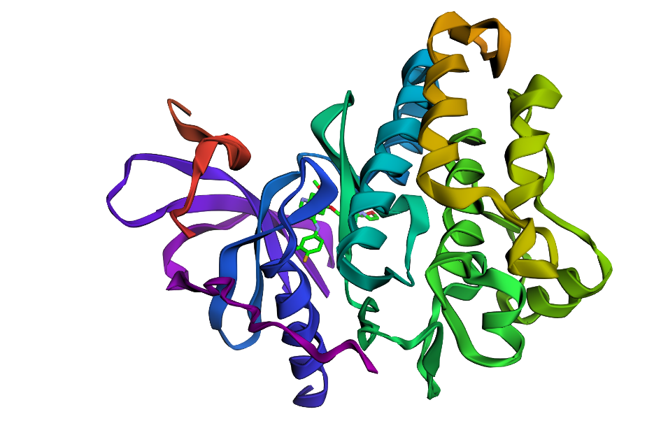
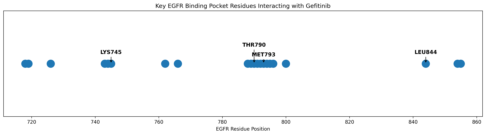

# EGFR-Gefitinib Interaction Analysis

## Project Overview

This project investigates the interaction between the Epidermal Growth Factor Receptor (EGFR) kinase domain and the anti-cancer drug Gefitinib using structural bioinformatics techniques.

---

## 3D Structure Visualization



The figure above shows the crystal structure of the EGFR kinase domain bound to Gefitinib (PDB ID: 4WKQ).

---

## Binding Pocket Analysis



Key residues interacting with Gefitinib were identified and visualized.

---

## Structure Information

| Parameter | Value |
|------------|--------|
| PDB ID | 4WKQ |
| Protein | EGFR Kinase Domain |
| Ligand | Gefitinib (IRE) |
| Resolution | 1.85 Å |

---

## Key Findings

- Identified 21 residues interacting with Gefitinib.
- Key binding residues:
  - LYS745 (Catalytic Residue)
  - THR790 (Gatekeeper Residue)
  - MET793 (Hydrogen Bond Residue)
  - LEU844 (Hydrophobic Pocket Residue)

---

## Skills Demonstrated

- Structural Bioinformatics
- Protein Structure Analysis
- Protein-Ligand Interaction Analysis
- BioPython
- Data Visualization
- Scientific Computing with Python
- Drug Discovery Concepts

---

## Biological Significance

Gefitinib is a first-generation EGFR tyrosine kinase inhibitor used in the treatment of non-small cell lung cancer (NSCLC).

THR790 is a clinically important gatekeeper residue. Mutations such as T790M are a major cause of acquired resistance to Gefitinib therapy.

---

## Technologies Used

- Python
- BioPython
- Pandas
- Matplotlib
- py3Dmol
- Jupyter Notebook

---

## Project Structure

```text
EGFR_Gefitinib_Interaction_Analysis
│
├── data
├── notebooks
├── results
├── README.md
└── requirements.txt
```
